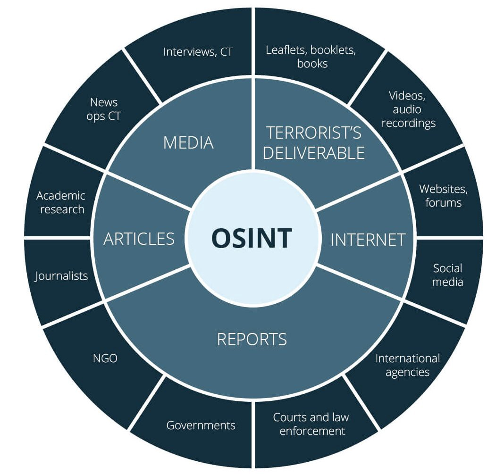

# OSINT

## OSINT 

Abreviação de Open Source Intelligence. Termo utilizado para inteligência gerada a partir da coleta de dados de fontes públicas. Dados coletados muitas vezes não geram valor. OSINT é somente uma foram de conduzir essas coleta de dados para geração de inteligência com análise dos dados

## TOOLS

### OSINT Framework

Site que agrega várias ferramentas offline e online para investigações OSINT:

[https://osintframework.com/](https://osintframework.com/)

